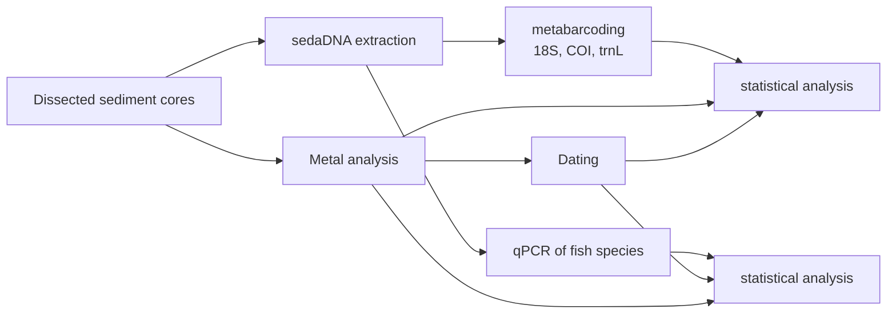

# Osisko
Metabarcoding project of sedimentary eDNA

Cores were collected from two locations, deep and littoral, in lakes Osisko and Dufay in the Rouyn-Noranda region. Lake Osisko is close to the Horne smelter which opened in 1927. Dufay lake is located 30 km from the smelter and serves as a control lake. Core slices were dated and used to reconstruct past communities and investigate the impact of the smelter. Currently, only Dufay cores are dated, for Osisko cores we use upper depths as a proxy of age. Community structure was assessed via qPCR for four fish species (Sander vitreus (eSAVI2), Perca flavescens (ePEFL1), Castostomus commersonii (eCACO4), and Esox lucius (eESLU1)), 18S primers (all eukaryotes), CO1 primers (phytoplankton and zooplankton), and the trnL region of the P6 loop (plants). This depot contains the code files used for processing and stats.

# Osisko workflow

